<div align="center">

</div>

# 🌍 Gaia 3.0: Global AI Inventory Allocation
### *The Smart-Grid for Food Recovery & Safe Logistics*

Gaia 3.0 is a decentralized **AI Smart-Grid** for food rescue. It treats surplus food as a high-value utility, routing it from food retailers and restaurants to community hubs using advanced multimodal generative AI and deep reasoning protocols.

---

## 🛠️ How It Works (The Core Flow)
New users can navigate the system through this primary lifecycle:

```mermaid
flowchart LR
    A[<b>1. Scan Surplus</b><br/>User uploads photo] --> B[<b>2. AI Metadata</b><br/>Gemini identifies food,<br/>servings & shelf-life]
    B --> C[<b>3. Grid Injection</b><br/>Human verifies data &<br/>publishes to Map]
    C --> D[<b>4. Discovery</b><br/>AI Grounding finds<br/>nearby NGO hubs]
    D --> E[<b>5. Grid Injection</b><br/>Active Registration<br/>of Hubs onto Map]
    E --> F[<b>6. AI Dispatch</b><br/>Reasoning engine solves<br/>optimized logistics]
    F --> G[<b>7. Impact</b><br/>Secure delivery &<br/>carbon offset logged]
    
    style A fill:#e0f2fe,stroke:#0369a1
    style E fill:#e0f2fe,stroke:#0369a1
    style F fill:#dcfce7,stroke:#15803d
```



### 🔹 1. Intelligent Node Registration
*   **Action:** Locate your facility on the map and tap to create a node.
*   **Multimodal Scan:** Use the **AI Vision Scanner** to capture food surplus photos. Gemini 3 Flash automatically extracts specific dish names, estimates portion volume, and predicts shelf-life.
*   **Verification:** Refine AI-generated metadata manually to ensure 100% data accuracy before publishing to the grid.

*   **Infrastructure Grounding:** Use the **Discover Local Hubs** tool to connect with real-world NGO data (Food Banks/Shelters) anchored via Google Maps.
*   **Active Map Registration:** Instantly register discovered hubs directly onto the GAIA Map with one click. The system extracts precise coordinates (lat/lng) so the new nodes can immediately participate in the smart-grid.
*   **Grid Optimization:** Once nodes are established, trigger the **Execute AI Dispatch**. The thinking-mode reasoning engine calculates the most efficient routing pairs based on perishability and humanitarian urgency.

### 🔹 3. Secure Verification & Logistics
*   **Safety Handshake:** Complete digital safety inspections (temperature checks/sealing) and fund allocation sharing before finalizing the route.

---

## 💡 The Gaia 3.0 Analogy: Our "Food Smart-Grid"
*How we explain the tech to non-developers.*

Think of Gaia 3.0 like a **Modern Power Grid**, but for food instead of electricity.

1.  **The Generators (Source):** Restaurants and stores are like "Power Plants." They often have extra energy (surplus food) that normally goes to waste. **`./App.tsx`** manages these visual nodes.
2.  **The Intelligent Meter (AI Vision):** When a user takes a photo, our AI acts like a smart meter. It identifies exactly what "voltage" (food type) and "wattage" (quantity) is available. **`./services/geminiService.ts`** handles this complex multimodal reasoning.
3.  **The Grid Controller (AI Dispatch):** The "Thinking" AI acts like the master controller. It looks at the whole map and routes the "power" from plants to neighborhood hubs via the fastest path. This high-dimensional logic lives in **`./services/geminiService.ts`**.
4.  **The Secure Bridge (The Proxy):** Because the AI official requires highly specific packaging, we use a **"Digital Security Vault"** to organize all records. **`./server.js`** acts as this professional assistant, ensuring every request is neatly wrapped in a **"Formal Security Envelope"** for safe processing in the cloud.

---

## 🏗️ System Architecture
Gaia 3.0 utilizes a secure **Backend-for-Frontend (BFF)** architecture to ensure enterprise-grade security and AI performance:


---

## 💎 Gemini 3 Implementation: Core Features
Gaia 3.0 is built on the cutting edge of generative AI, utilizing the full suite of Gemini 3 capabilities:

### 1. 👁️ Multimodal Inventory Scan (Flash Vision)
*   **The Feature:** Users can upload or snap a photo of any food surplus. 
*   **Action:** Gemini 3 Flash analyzes the image to identify specific dishes, estimate portion volumes, and predict shelf-life based on visual freshness markers. It transforms a raw photo into actionable grid data.

### 2. 🗺️ Geospatial Hub Grounding (Tool Use + Structured Data)
*   **The Feature:** Discovery and active registration of real-world community resources.
*   **Action:** Using **Google Maps Grounding**, the AI identifies verified food banks and shelters. Crucially, it generates **structured geospatial JSON** (coordinates, descriptions, websites) allowing users to register these hubs onto the live map as active demand nodes.

### 3. 🤔 Autonomous Dispatch (Thinking Mode)
*   **The Feature:** High-dimensional logistics reasoning.
*   **Action:** **Gemini 3 Pro** executes deep logical reasoning to solve complex routing problems. It balances multiple supply and demand nodes simultaneously, accounting for urban traffic, perishability hierarchy, and humanitarian priority to generate optimized dispatch plans.

---

## 🛠️ Engineering Log: Challenges & Solutions

## 🚀 Getting Started

### Local Development
1.  **Install dependencies:** `npm install`
2.  **Set Environment:** Add `VITE_API_KEY` to your `.env` file.
3.  **Run:** `npm run dev`

### Production Deployment Guide
Gaia 3.0 is containerized and deployed using Google Cloud Build and Cloud Run. This architecture uses a **Secure Proxy** to ensure your Gemini API Key is never exposed to the public.

**1. Build & Push via Cloud Build:**
```bash
gcloud builds submit --tag gcr.io/YOUR_PROJECT_ID/gaia-3-0 .
```

**2. Deploy to Cloud Run:**
Replace `YOUR_GEMINI_API_KEY` with your actual key from AI Studio/Vertex AI.
```bash
gcloud run deploy gaia-smart-grid \
  --image gcr.io/YOUR_PROJECT_ID/gaia-3-0 \
  --platform managed \
  --region us-central1 \
  --allow-unauthenticated \
  --set-env-vars GOOGLE_AI_KEY=YOUR_GEMINI_API_KEY
```

---

## 🛠️ Engineering Log: Challenges & Solutions
*A living record of the technical hurdles overcome during the Gaia 3.0 build.*

### 1. The "Secretless" Security Barrier
*   **Challenge:** We needed to use powerful AI models in a public app without exposing our private Gemini API keys in the user's browser.
*   **Solution:** Built a **Secure AI Proxy** using Express.js. This architecture acts as a "Digital Security Vault"—the browser talks only to our server, and our server safely talks to Google using an environment-based key.

### 2. The Model Availability Puzzle
*   **Challenge:** During production testing, the latest "Gemini 3 Preview" models were returning **404 Not Found** errors in specific regions.
*   **Solution:** Transitioned the backend logic from Vertex AI Identity auth to the **Stable `@google/genai` logic**. This provided a unified way to handle both "Flash" and "Pro" models with 100% reliability across all environments.

### 3. The "Formal Envelope" Mismatch
*   **Challenge:** The production AI server was rejecting requests with a **400 Bad Request** error because it required a very strict nested data structure (Roles and Parts) that differred from our local testing setup.
*   **Solution:** Rewrote the communication bridge in `server.js` and `geminiService.ts` to strictly follow the **Professional Content Schema**. We ensured every image and text prompt is now "packaged" perfectly before being sent to the AI.

---

**Public URL:** [Gaia 3.0 Live Environment](https://gaia-smart-grid-507647380467.us-central1.run.app)
