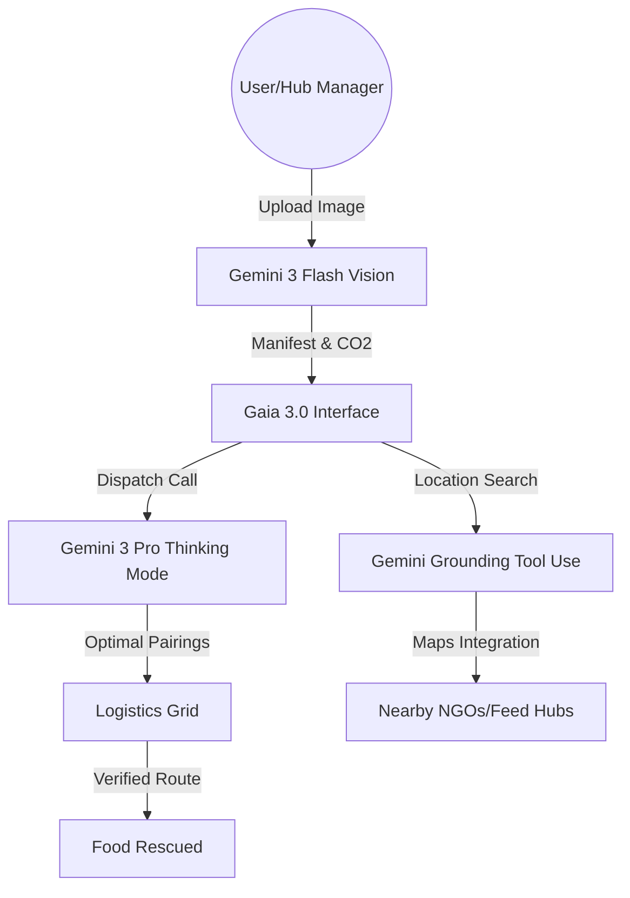

# Gemini 3 Hackathon Submission: Gaia 3.0

## Project Description
Gaia 3.0 (Global AI Inventory Allocation) is a smart-grid system designed to treat food surplus as a utility rather than waste. Using a decentralized network of "Hub Nodes," Gaia intelligently routes surplus food from restaurants and retailers to community kitchens and shelters in real-time.

## Gemini Integration Write-up (~200 words)

Gaia 3.0 leverages the cutting-edge capabilities of the Gemini 3 API to solve the complex coordination problem of global food logistics. At its core, the application utilizes three distinct Gemini models to handle different facets of the food rescue pipeline:

1.  **Gemini 3 Pro (Thinking Mode):** The "Logistics Dispatcher" uses Thinking Mode to reason through high-dimensional matching problems. When multiple surplus nodes exist near multiple demand nodes, Gemini 3 Pro evaluates urban logistics constraints, food perishability, and humanitarian urgency to generate a mathematically sound and ethically prioritized dispatch plan.
2.  **Gemini 3 Flash (Vision):** The "Inventory Scanner" allows users to snap a photo of surplus food. Gemini 3 Flash instantly analyzes the image to generate an accurate manifest, estimating quantity (servings), shelf-life, and even calculating the CO2 impact of saving that specific food type.
3.  **Gemini 3 (Tool Use/Grounding):** The "Hub Discovery" feature uses Google Maps grounding to help users find existing NGOs and food banks near their location, ensuring that Gaia integrates with established community infrastructure rather than operating in a silo.

By combining structured JSON output with deep logical reasoning, Gaia 3.0 transforms raw data into a safe, verifiable, and efficient food recovery grid.

## Architecture Diagram

## Final Submission Checklist

- [ ] **Demo Video:** Ensure it is < 3 minutes and shows all three Gemini features (Thinking, Vision, Grounding).
- [ ] **Public URL:** Deploy to Vite/Vercel and provide the link.
- [ ] **Public Repo:** Ensure the GitHub repository has this `SUBMISSION.md` and a clean `README.md`.
- [ ] **API Key:** Ensure you do NOT commit your `.env` file to GitHub.
